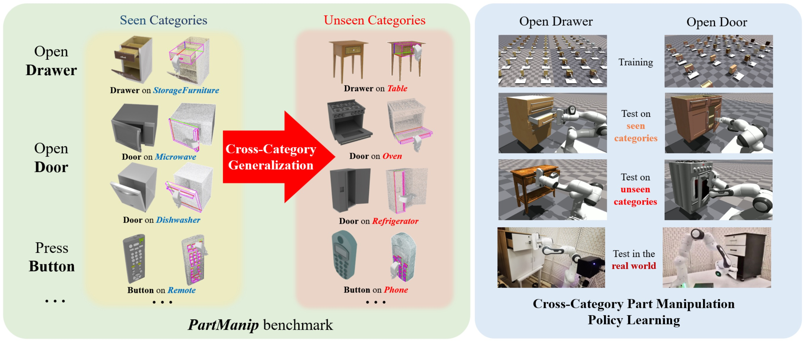
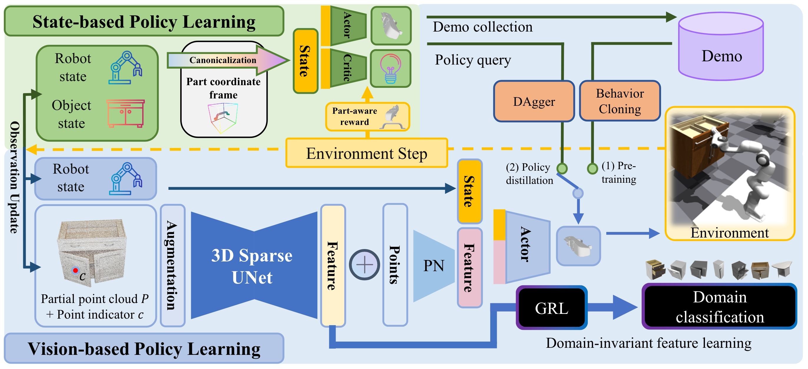
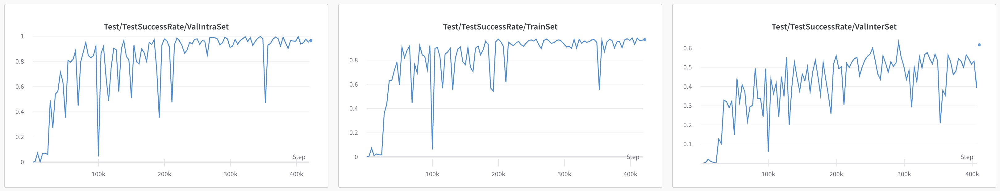
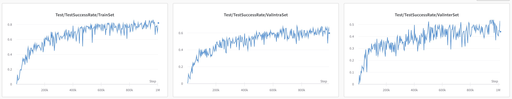

<h2 align="center">
  <b>PartManip: Learning Cross-Category Generalizable Part Manipulation Policy from Point Cloud Observations</b>

  <b><i>CVPR 2023</i></b>


<div align="center">
    <a href="https://cvpr.thecvf.com/virtual/2023/poster/22553" target="_blank">
    </a>
    <a href="https://arxiv.org/abs/2303.16958" target="_blank">
    </a>
    <a href="https://pku-epic.github.io/PartManip/" target="_blank">
    </a>
</div>

</h2>

This is the official repository of [**PartManip: Learning Cross-Category Generalizable Part Manipulation Policy from Point Cloud Observations**](https://arxiv.org/abs/2303.16958).

For more information, please visit our [**project page**](https://pku-epic.github.io/PartManip/).

## Overview

We introduce a large-scale cross-category part manipulation benchmark PartManip with diverse object datasets, realistic settings, and rich annotations. We propose a generalizable vision-based policy learning strategy and boost the performance of part-based object manipulation by a large margin, which can generalize to unseen object categories and novel objects in the real world.


We first train state-based expert policy using our proposed canonicalization to the part coordinate frame and the part-aware reward. We then use the learned expert to collect demonstrations for pre-training the vision-based policy by behavior cloning. After pre-training, we train the vision-based policy to imitate the state-based expert policy using DAgger. We also introduce several point cloud augmentation techniques to boost the generalization ability. For the vision backbone, we introduce 3D Sparse-UNet which has a large expression capability. Furthermore, we introduced an extra domain adversarial learning module for better cross-category generalization.

## Dataset & Assets
To obtain our assets, please fill out [this form](https://forms.gle/DqdPvLE6pNWZf2XR8) and check the Terms&Conditions in it. Please cite our paper if you use our dataset.

## How to use our code

### Installation

1. install issacgym following the [official guide](https://developer.nvidia.com/isaac-gym)

2. install dependencies
```
pip install wandb tensorboard ipdb gym tqdm rich opencv_python pytorch3d pyparsing pytorch_lightning addict yapf h5py sorcery pynvml torchdata==0.5.1 einops
```

3. (Optional for full implementation, not necessary) install GAPartNet environment following the [official guide](https://github.com/geng-haoran/GAPartNet_env)

### Training and Testing

For training:

run scripts in `scripts/train.sh` to train different tasks.

An example:
```
# drawer
python gym/train.py --task=FrankaPoseCabinetBase --algo=pregrasp_ppo \
--task_config=cfg/task_cfg.yaml --algo_config=cfg/algo/pregrasp_ppo.yaml \
--sim_device=cuda:0 --graphics_device_id=0 --seed=0526 --headless \
--group_name state --save_name 0.2_2_0_1_0_2 \
--rot_coef 0.2 --handle_coef 2 --vel_coef 0 --dist_coef 1 --tip_coef 0 --dicouple_coef 2 \
--target open --category drawer --minibatches 2 --nsteps 5 --noptepochs 8 \
--canonical_space handle --pregrasp part --obs state --eval_round 3 --eval_freq 10 \
--action_normalization clip --control ik_abs_axis_angle --asset_num 200_40_40_5
```

For testing:

run scripts in `scripts/test.sh` to test different tasks with trained ckpt.

An example:
```
# drawer
python gym/train.py --task=FrankaPoseCabinetBase --algo=pregrasp_ppo \
--task_config=cfg/task_cfg.yaml --algo_config=cfg/algo/pregrasp_ppo.yaml \
--sim_device=cuda:0 --graphics_device_id=0 --seed=0526 --headless \
--group_name state --save_name 0.2_2_0_1_0_2 \
--rot_coef 0.2 --handle_coef 2 --vel_coef 0 --dist_coef 1 --tip_coef 0 --dicouple_coef 2 \
--target open --category drawer --minibatches 2 --nsteps 5 --noptepochs 8 \
--canonical_space handle --pregrasp part --obs state --eval_round 3 --eval_freq 10 \
--action_normalization clip --control ik_abs_axis_angle --asset_num 200_40_40_5 \
--test --ckpt xxxx.tar
```

### Training Curve
There are some examples of our tested training curves:

A training example of drawer:



A training example of door:



## License

 This work and the dataset are licensed under [CC BY-NC 4.0][cc-by-nc].

 [![CC BY-NC 4.0][cc-by-nc-image]][cc-by-nc]

 [cc-by-nc]: https://creativecommons.org/licenses/by-nc/4.0/
 [cc-by-nc-image]: https://licensebuttons.net/l/by-nc/4.0/88x31.png

## Citation
If you find our work useful in your research, please consider citing:

```
@article{geng2023partmanip,
    title={PartManip: Learning Cross-Category Generalizable Part Manipulation Policy from Point Cloud Observations},
    author={Geng, Haoran and Li, Ziming and Geng, Yiran and Chen, Jiayi and Dong, Hao and Wang, He},
    journal={arXiv preprint arXiv:2303.16958},
    year={2023}
}
```

## Contact
If you have any questions, please open a github issue or contact us:

Haoran Geng: ghr@stu.pku.edu.cn

He Wang: hewang@pku.edu.cn
